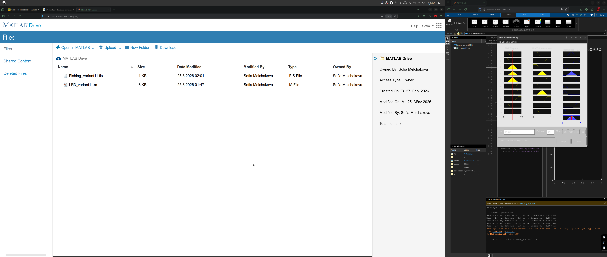

# X-Clone (Twitter Clone) — фінальний проєкт

**Студент:** Хмелюк Сергій  
**Курс:** Розробка мобільних додатків з використанням React Native (10.0.1)  
**Дата іспиту:** 16.05.2026

## Опис

Мобільний клон X (Twitter) на **React Native** та **Expo Router** з бекендом **Convex** та авторизацією **Clerk** (Google OAuth).

### Реалізований функціонал

- Авторизація через Google (Clerk + Convex JWT)
- Стрічка постів, створення постів з фото
- Лайки, коментарі, закладки, сповіщення
- Профіль користувача та профілі інших користувачів
- Stories (додавання та перегляд)
- Реальний чат між користувачами
- EAS Build (development / preview / production)

## Запуск локально

1. Встановити залежності:

```bash
npm install
```

2. Створити `.env` на основі `.env.example`:

```env
EXPO_PUBLIC_CLERK_PUBLISHABLE_KEY=pk_test_...
EXPO_PUBLIC_CONVEX_URL=https://....convex.cloud
```

3. Запустити Convex (окремий термінал):

```bash
npx convex dev
```

4. Запустити Expo:

```bash
npx expo start
```

## Репозиторій

Публічний репозиторій ще не створено (посилання `MelchakovaSofia/x-clone` дає 404).

Після створення репозиторію на GitHub додайте сюди актуальне посилання, наприклад:

`https://github.com/ВАШ_ЛОГІН/x-clone`

## Збірки (EAS)

Посилання на збірки — у файлі `build-links.txt`.

## Скріншоти


